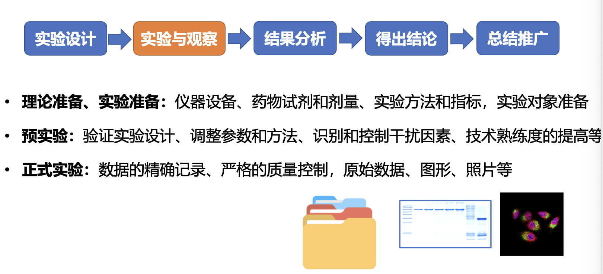

# 生理科学实验

## 绪论

实验动物基本知识

实验动物的品系及分类

**品系**：来源于同一祖先，生物学特性大致相同的一个群体

**按遗传学特征分类**

**近交系**：用20代以上的同胞兄妹或亲子繁殖子代所育成的遗传基因纯化的品系

**杂交一代**：有两个近交系繁育的子一代

**突变品系**：由单基因的突变，或者基因导入或删除，多代繁育成的品系，具有相同的遗传缺陷或疾病

**远交系（封闭群）**：在同一血缘品系内随机繁衍子代，经5年以上育成的同一血缘关系的种群。遗传背景稳定但非完全一致（与近交系不同）

| 项目             | 远交系（封闭群）     | 近交系（Inbred）         |
| ---------------- | -------------------- | ------------------------ |
| 遗传结构         | 多样，存在杂合       | 高度一致，同质纯合       |
| 基因背景         | 有差异               | 几乎完全相同             |
| 实验重复性       | 中等                 | 高                       |
| 模拟人群个体差异 | 更接近               | 不适合                   |
| 常见用途         | 药效毒理、营养学研究 | 免疫、遗传、疾病机制研究 |

**非纯系**：任意交配繁殖的动物

- 生命力，适应性强，繁殖率高
- 个体差异大，反应性不规则

------

**按携带的微生物分类**

**普通动物：**又称一级动物，要求不带有动物烈性传染病和人畜共患病原体，如鼠痘病毒，沙门菌，志贺菌，布氏杆菌，结核分枝杆菌

**清洁动物：**又称二级动物，在普通动物的基础上，排除对动物危害大和科学实验干扰大的病原体

**无特殊病原体动物**：又称三级动物，在二级动物的基础上，在排除有潜在感染或条件致病的病原体，以及对实验干扰大的病原体，如金黄色葡萄球菌、绿脓杆菌，小鼠肺炎病毒等

**无菌动物**：又称为四级动物，用当前的技术手段无法在动物体表体内检出一切生物体

- 悉生动物，人为地植入一种或几种微生物的无菌动物

------

**种属选择**

- 豚鼠：用于过敏反应或变态反应的研究
- 兔：用于发热，热源鉴定，解热药
- 狗、大鼠、家兔：常用于高血压的研究

**品系的选择**

- DBA/2小鼠 听源性癫痫发作率为100%
- C57BL小鼠 听源性癫痫发作率为0%
- A/J小鼠多环芳烃致癌剂又到肺癌发生率为50～60%
- C57BL小鼠环芳烃致癌剂诱导肺癌的发生率为0%

**个体的选择**

- 同品系的实验动物对同一刺激物的反应存在个体差异
- 敏感度：幼年>老年>成年

动物实验技术

急性实验动物方法——短时间内观察到机体和器官的功能和代谢改变

- 优点：时间短，效率高，条件易于控制
- 缺点：非自然生活状态

- 离体组织组织、器官实验法
  - 排除神经、体液、代谢产物的影响
  - 可以精确地控制实验条件、处理因素与实验效应的关系比较明确
- 在体实验方法
  - 实验效应是多种因素相互作用的结果
  - 优点：比较接近真实情况

**慢性动物实验方法**——较长时间内观察机体的功能和代谢变化

- 接近自然生活状态和生理状态，结果比较真实
- 缺点是时间长，条件难以控制，干扰因素多

**常见的给药方法**

- 小鼠腹腔注射、尾静脉注射、口服（自然吞咽、灌胃法）
- 家兔耳缘静脉注射、腹腔注射、皮下注射、口服

常用手术器械使用介绍

粗剪刀：剪毛发、皮肤、肌肉、骨

手术剪：剪切皮肤、肌肉、血管等软组织，圆头端可以插入组织间隙，分离、剪切无血管的肌肉和结缔组织

眼科剪刀：剪切神经、血管、包膜等精细组织

- **禁止用眼科剪剪切皮肤、肌肉、骨等组织**

手术刀：用于切开和剥离组织

- 刀片的安装与拆卸宜采用止血钳或持针钳夹持，防止割伤

血管钳（止血钳）：主要用于钳夹血管或止血点以止血，也可以用于钝性分离，协助术者拔针或牵引缝线

持针钳：持针钳头部较短，齿痕较浅，用于夹持缝针缝合各种组织

手术镊

- 组织镊用于夹持和提起组织，以利于解剖和缝合
- 眼科镊用于夹捏软组织

探针：用于毁蛙类动物的脑和脊髓

锌铜弓：用于检查离体肌肉标本的兴奋性

动脉夹：用于暂时夹断动脉血流

注射器需要注意安装针头时针头的斜面需要与注射器的容量刻度标尺在同侧，并略微旋转压紧针头

玻璃分针：表面光滑，不易对组织造成损伤，用于分离血管和神经，使用前使用少量的生理盐水浸润

实验研究基本程序

### 复习思考题

1. **实验研究的基本原则有哪些？如何评价某个具体的研究项目是否符合这些原则？**

   - 需要性原则（解决人民的生活生产问题）、目的性原则（明确要解决什么问题）、创新性原则（解决前人没有解决的问题）、先进性原则（发明新技术）、科学性原则（课题有理论依据）、可行性原则（课题设计要有可用的研究资源）、效能型原则（产出投入比）

2. **实验设计的三大因素有哪些？如何在实验设计中体现处理因素的标准化？**

   - **受试对象**
   - **处理因素**
   - **实验效应**

   | 方法                 | 说明                                                         |
   | -------------------- | ------------------------------------------------------------ |
   | **保持其他变量恒定** | 除了处理因素外，其余环境条件（温度、湿度、光照、饲养方式等）应严格统一 |
   | **统一实验流程**     | 实验步骤、时间、剂量、操作人员等尽量一致                     |
   | **使用对照组**       | 设置空白对照、阳性对照等，帮助比较和排除外因                 |
   | **随机化分组**       | 通过随机分配受试单位，减少系统性偏倚                         |
   | **重复实验**         | 在相同条件下重复，降低偶然误差干扰                           |

3. **实验设计的基本原则有哪些？不同对照组的意义和区别是什么？**

   - **对照原则**——空白对照、实验对照、自身对照、阳性对照、相互对照、阴性对照

     - **阴性对照**：排除溶剂本身对实验结果的干扰，确保观察到的效应仅由目标药物或处理因素引起

     - **空白对照**：不加入任何实验处理（如药物、刺激物等），也不含实验因子的组。主要用于排除环境、试剂等非实验因素的干扰
     - **实验对照**：广义上所有“对照组”都属于“实验对照”，但通常特指与实验组平行设置，仅缺少一个关键变量（如药物、处理）的组，用于比较和验证实验组结果
     - **自身对照**：实验对象在接受实验处理前后的状态进行比较，即自己与自己作对照
     - **阳性对照**：使用一个已知能产生预期效应的处理或药物，用于验证实验系统是否正常工作
       - 比如用阿司匹林作为阳性对照，如果阿司匹林那组**肿胀显著减轻**，说明：
         - 模型造得成功（因为有炎症发生）；
         - 阳性药有效，说明实验系统可靠；
         - 可以用来判断新药XXX是否有同样或更强的抗炎作用
         - **如果阿司匹林都没效果**，要么模型没建好（造模失败），要么实验方法不敏感
     - **相互对照**：两个实验组互为对照，通常是在比较两个处理条件之间的效果差异时使用

   - **随机原则**
     - 在分组或处理时，通过随机的方法将实验对象分配到不同的组中，使每个对象被分配到任何一组的机会是**相等的**，从而**消除系统误差**，减少**人为偏倚**

   - **重复原则**
     - **在相同条件下重复进行实验，以确保实验结果的可靠性和可重复性**。其核心目的是排除偶然因素的干扰，提高数据的可信度

4. **完全随机设计和配对设计的特点和区别是什么？如何判断某个具体的研究设计属于**
   **哪个实验设计方法（完全随机设计或配对设计）？**

  - 完全随机设计是将每个受试单位随机地分配到对照组和处理组，特点是设计和处理相对简单，**每个受试单位只接受一个处理**

    - 设计简单，操作方便

      各组之间的受试单位**相互独立**

      要求受试单位**同质性较高**（即个体差异小）

      常用于大样本，个体差异可忽略的情况

  - 配对设计中，每个受试单位或两个**高度相似的单位（如双胞胎、左右对照、前后对照）**分别接受两种不同处理，用于比较两种处理的差异

    - **控制个体差异**，提高比较效率

      各对之间独立，但对内相关

      常用于小样本、个体差异大的情况

      每对单位接受**两种处理**

5. **如何根据某个具体的研究问题，选择合适的实验设计和统计分析方法？**

   - 根据研究问题确定实验动物种类和处理因素。后进行实验分组设计，确定实验对象数量，实验方法以及观察指标。根据分组、实验方法和观察指标确定数据的表示方法和统计学分析方法

     - 研究目的
       - 比较不同处理因素
       - 分析变量之间的关联
       - 检验某干预是否有效

     - 受试单位

       - 实验动物种类

       - 是否独立
       - 是否重复测量或配对

     - 处理因素的类型和数量
       - 单因素 or 多因素
       - 控制混杂因素

     - 观测指标的类型
       - 计量型
       - 计数型
       - 分类型

6. **实验研究论文各部分的主要撰写要求有哪些？**

   - **前置部分**
     - 题目（不超过20字，最多30字）简洁、准确地反映研究的核心内容；  避免过长，避免使用缩写（除非通用如DNA）；  一般不带标点；  可包括研究对象、主要变量、方法等关键词。
     - 著者署名
     - 摘要（通常 300~500字，**包括研究背景、目的、方法、结果、结论**，不含引用和图表，过去时态）
     - 关键词：（3～8个）
   - **主体部分**
     - 引言（200~800字，引出研究问题：当前研究背景和已有进展；  提出研究空白或问题；  明确研究目的和假设）
     - 材料、方法、结果、讨论、结论（少于200字，不用图表），致谢、参考文献
   - **附录部分**(原始数据)

7. **如何判断生物信号的交直流特性和耦合方式？**

   - **舒张压（diastolic pressure）：是心脏舒张末期的最低血压，通常被视为基础血压水平**。在整个心动周期中，它代表一个相对稳定的基线压力，类似于直流信号（DC），因为它提供一个恒定的参考值。

   - **收缩压（systolic pressure）：是心脏收缩时的最高血压，它随着每次心跳周期性变化**，类似于交流信号（AC），因为它有波动成分。

   血压信号的整体可以看作是一个直流分量（舒张压）加上一个交流分量（收缩压与舒张压之间的脉动）。

   - **直流（DC）信号**

     - 指**电位长期保持一个稳定偏移值**，变化缓慢或基本不变；
     - 信号有慢性变化、稳定偏移值

   - **交流（AC）信号**

     - 电位围绕0上下波动，**快速变化**，有明显频率成分
     - 信号围绕0波动，无基线漂移

   - | 应用                       | 信号性质               | 常用耦合方式                           |
     | -------------------------- | ---------------------- | -------------------------------------- |
     | **脑电图（EEG）**          | 交流信号（0.5–100 Hz） | **交流耦合**                           |
     | **心电图（ECG）**          | 混合，主要为交流成分   | **交流耦合**（也可DC用于研究缓慢变化） |
     | **肌电图（EMG）**          | 快速变化，交流信号     | **交流耦合**                           |
     | **缓慢诱发电位、皮肤电位** | 低频/直流              | **直流耦合**                           |

     | 项目                  | 直流耦合（DC Coupling）            | 交流耦合（AC Coupling）          |
     | --------------------- | ---------------------------------- | -------------------------------- |
     | 信号路径              | **不经过耦合元件**，直接连接放大器 | **经过电容等耦合元件**，滤除直流 |
     | 能否通过低频/直流成分 | ✅ 可以                             | ❌ 不可以（低频会被滤除）         |
     | **是否设置时间常数**  | 不需要（∞）                        | 需要（如0.02s）                  |
     | 典型用途              | **细胞内记录**、应变计             | **细胞外记录**（如神经干）       |
     | 优势                  | 能完整记录缓慢变化                 | 抑制漂移、稳定基线               |
     | 缺点                  | 易受基线漂移、电极极化影响         | 无法观察直流偏移或慢电位         |

     **直流耦合**：电信号不通过耦合器件（电容器或者电感器），直接送入放大器输入端进行放大的方式，多用于细胞内引导的生物电信号于应变式换能器的输出信号

     **交流耦合**：信号通过耦合器件，多用于细胞外引导，需要设定时间常数

   - 细胞内记录需要刺破膜电极，记录**膜内外真实电位差**，数据包含直流偏移，需要**直流耦合**；神经干实验只用表面电极贴在神经外层，不关心膜内外绝对电位，只关心动作电位的波动 → 用**交流耦合更合适**

8. **生物信号采集处理系统的常用参数有哪些？各自的设置要求是什么？**

   - **滤波频率：滤除高频干扰**
   - **时间常数（高通滤波器）：滤除低频干扰**，时间常数与滤波有关，时间常数越小，**下限截止频率越高**，对低频成分的滤波程度越大。

9. **常用实验动物的特性和主要研究应用是什么？善待实验动物的主要要求有哪些？**

   | 实验动物                       | 主要特性                                                     | 常见研究用途                                                 |
   | ------------------------------ | ------------------------------------------------------------ | ------------------------------------------------------------ |
   | **小鼠**（Mouse）              | 体型小、繁殖快、遗传背景清楚、转基因模型丰富                 | 遗传学、肿瘤学、免疫学、代谢病（如糖尿病）、神经科学、药效毒理研究 |
   | **大鼠**（Rat）                | 体型较大，便于手术操作，行为模型丰富                         | 心血管病、脑科学（记忆/行为）、内分泌与代谢、药物代谢、药理毒理 |
   | **豚鼠**（Guinea pig）         | 呼吸道敏感、免疫反应较强，自体不能合成维生素C                | 呼吸系统疾病、免疫学、听觉研究（耳蜗发育）、营养研究（**维生素C依赖**） |
   | **家兔**（Rabbit）             | 血管较粗，易于采血、注射；**减压神经单独行走**；眼球大，适合眼科研究 | 眼科学、心血管疾病、动脉粥样硬化、皮肤实验、抗体制备（多克隆抗体） |
   | **狗**（Beagle犬等）           | **与人类生理结构相似度较高**，适合长期实验                   | 药代动力学、心血管研究、外科手术模型、移植与麻醉学研究       |
   | **猫**                         | 脑和感觉系统结构复杂                                         | 神经生理研究、视觉/听觉中枢研究                              |
   | **猴子**（恒河猴、食蟹猴）     | 与人类亲缘关系最近，适合复杂认知和疫苗研究                   | 神经科学、行为学、传染病（HIV/冠状病毒等）研究、疫苗与毒理   |
   | **斑马鱼**（Zebrafish）        | 胚胎发育快、透明，便于显微观察，基因编辑容易，有完整的消化、泌尿系统，性成熟周期短，易繁殖 | 发育生物学、毒理学、基因功能研究、药物筛选                   |
   | **秀丽隐杆线虫**（C. elegans） | 期短，易繁殖个体小、透明、基因组小、寿命短                   | 基因调控、神经发育、衰老机制研究                             |
   | **果蝇**（Drosophila）         | 遗传模型成熟，生命周期短，繁殖快                             | 遗传学、发育生物学、神经科学、行为学                         |
   | **蟾蜍（Toad）**               | 离体组织和器官所需的生理环境比较简单                         | 神经生理学、肌肉生理、心脏生理、微循环                       |
   | **猪（Pig）**                  | 皮肤、内脏与人相似                                           | 皮肤烧伤，肿瘤学，免疫学，心血管与糖尿病，遗传学与营养性疾病，器官移植 |

   | 疾病模型     | 常用动物                | 备注                       |
   | ------------ | ----------------------- | -------------------------- |
   | 糖尿病模型   | 小鼠（STZ诱导）、GK大鼠 | 模拟I型、II型糖尿病        |
   | 动脉粥样硬化 | ApoE基因敲除小鼠、兔    | ApoE-/-小鼠为经典模型      |
   | 肿瘤研究     | 裸鼠（无胸腺免疫缺陷）  | 种植人类肿瘤细胞进行实验   |
   | 阿尔茨海默病 | APP/PS1转基因小鼠       | 模拟老年痴呆症             |
   | 听觉研究     | 豚鼠、斑马鱼            | 耳蜗发育好、结构类似       |
   | 疫苗研究     | 恒河猴、小鼠            | 恒河猴用于HIV/新冠疫苗研究 |
   | 骨科/眼科    | 家兔                    | 骨骼大、眼球结构接近人类   |

   - 实验动物的原则是：3R原则
     - 有益于科学技术的创新和发展
     - 减少、替代、优化
     - 动物免遭不必要的伤害
     - 不得戏弄、虐待动物
     - 应该将动物的惊恐和疼痛减少到最低的程度，避免无关人员进入
     - 有创实验，必需进行有效麻醉，恢复期疼痛、护理、饮食调理

10. **家兔实验中，如何判断麻醉效果是否合适**

- 若角膜反射迟钝，则已到深度，观察四肢，腹壁肌肉的紧张性以及血管钳夹捏前后肢指甲的反应。若已到麻醉深度，则不需再注射

  给药先快后慢，推入药物三分之二时，拿棉签在眼角膜上滑动，若眨眼迅速灵敏，则麻醉未到深度，若角膜反射迟钝， 观察四肢、 腹壁肌肉的紧张性以及皮肤的夹捏反应。 若已到麻醉深度，则不需再注射（若麻醉过量呼吸急停，翻过兔身，有节律按动胸廓）

- 注意防止窒息

## 神经干双向动作电位

参数设置：时间常数0.02s，滤波频率3kHz，灵敏度5mV，扫描速度0.2ms/div，采样频率100kHz，刺激器同步触发，单刺激，强度1.0V，波宽0.1ms，延迟1ms

神经干由许多神经纤维组成，各个类型纤维的兴奋性水平不同，故神经干动作电位与单根神经纤维的动作电位不同，神经干动作电位是由许多不同直径和类型的神经纤维动作电位叠加而成的综合性电位变化，称**复合动作电位**，神经干动作电位幅度在一定范围内可随刺激强度的变化而变化。动作电位在神经干上传导有一定的速度。不同类型的神经纤维传导速度不同，神经纤维越粗则传导速度越快。蛙类坐骨神经干以A类纤维为主，传导速度大约30-40m/s。

复合动作电位不遵循“全或无”的性质。离体蟾蜍坐骨神经具有双向传导兴奋的能力

膜电位的负性变化的开始和结束均不是突然的，而是有一定坡度，并且不对称。开始部分较结束部分变化快，故正相波结束时的波形较陡，负相波结束时的波形较平缓。

理论上

(1) 若叠加发生在**正相波去极后期，正相波波峰减小，时程缩短**，当神经冲动传导被阻断使负相波消失，正相波被叠加的部分显示出来，正相波的波幅和时程均增大；

(2) 若叠加发生在**正相波复极期，正相波波峰不减小，但时程缩短**，当神经冲动传导被阻断使负相波消失，正相波被叠加的复极化部分显示出来，正相波时程延长。

BAP是正相波和负相波叠加的结果，随着电极距离的变大，两个波的叠加效果应该会越小，因此它们的振幅应该变大或者不变。实验结果显示，引导电极间距为10mm、20mm和30mm时，所形成的正相振幅逐步增大(p<0.01)，由此可以得知本组实验所用的神经干引导电极在小于30mm的范围内，正相波和负相波的叠加发生在正相波去极后期

**药物**1mol/L **KCl**的作用：**去极化阻滞**作用，**细胞外K↑，K外流↓，静息电位抬高，Na通道受阻，不能产生动作电位**

**KCl注意扩散快，应该在procaine的实验之后再做**

处理后正相波振幅和时程均增大，这是由于正相波与负向波的叠加发生在正相波的**去极期**，负向波振幅的减少导致了负向波对正相波振幅削减程度的减少，即正相波振幅增加，且降低趋势减慢，故时程亦变长

**药物procaine的作用**：直接与电压门控的**Na+通道**相互作用而抑制Na+内流，从而阻止动作电位的产生和神经冲动传导

实验方案中：

- 先是将4%的procaine滤纸放置在R4电极处的神经干上，**5min**后再记录第二对引导电极引导的AP
- KCl实验结束后，先将1mol/L的KCl滤纸放置在R2电极处的神经干上，**2min**后再记录第一对引导电极引导的AP

计算出神经兴奋的传导速度

取两个峰值点测时间可以吗？不可以。但实际电位为复合的，不同纤维传导速度不同，峰值复合点对应的距离不一定是 R1R3如果神经干不平直、下垂对测量结果影响：实际距离大于测量距离，也就是传导时间变长，计算所得速度比真实速度小。

### 复习思考题

1. **本实验测定神经干动作电位的主要原理是什么？比如，引起神经纤维兴奋的条件、刺激电极和引导电极的设置、双相动作电位产生的原理、兴奋传导速度的测定原理等。**

   - 动作电位(action potential,AP)的产生是细胞受到有效刺激的结果。电脉冲刺激神经，刺激电极负极下的神经纤维产生去极化,当去极化达到阈电位水平时,细胞膜产生一次短暂、快速、可向远距离传播的电位波动,此即为动作电位。
   - 刺激电极位于中枢端，引导电极位于末梢端
   - 神经干动作电位是由许多不同直径和类型的神经纤维动作电位叠加而成的综合性电位变化，称**复合动作电位**
   - 先后经过2个放置在神经干表面的引导电极,两电极之间连接的示波器记录到2个相反方向的电位偏转波形,称为双相动作电位。
   - 测定第1和第2对引导电极引导的BAP起点的时间差Δt即可

2. **本实验的科学问题是什么？**

   - 为什么神经干双相动作电位不对称——即正相振幅Ap大于负相振幅An，正相时程小于负相时程？

3. **为回答本实验的科学问题，提出了哪三个科学假设？**

   - R1处神经纤维多于R2处，使BAP的正相波振幅大于负相波振幅（AP>AN）
   - 神经纤维的传导速度不同，离散程度随传导过程逐渐增加。AP在R1处的离散程度小于R2处，因此复合后AP>AN，DP<DN
   - BAP由不对称的负相波叠加于不对称正相波的去极后期形成AP>AN，DP<DN

4. **为求证每一个假设，对应设计了哪些实验？这些实验各自的预期结果是什么？**

   - 中枢端引导-末梢端刺激（后面都是中枢端刺激，末梢端引导），如果假设一成立，中枢端引导后AP<AN

     - **两个前提**

     - **R1引导出正相波、R2引导出负相波**
     - **兴奋的神经纤维数量与AP振幅成正变关系——>神经纤维不断分支，神经纤维数量逐渐减少，神经纤维的多寡可影响动作电位的振幅**

     

   - 改变R1R2间距离（中枢端刺激，末梢端引导，改变第二只引导电极的位置，R1处的电极不变），**如果假设二成立，R1R2间距增加，AP、DP不变，而AN会减小，DN会增大；如果假设三成立，R1R2间距增加，AP、AN增大，DP、DN增大**

   - **机械阻断R1R2（在R2前紧贴R2处用镊子夹伤神经干，为何要紧贴？因为损伤电位）**，以不同强度刺激（中枢端刺激，末梢端引导）/KCl、procaine阻断R1R2

     - 当神经纤维（尤其是神经干）受到**机械、缺血或其他损伤**时，在损伤部位和未损伤部位之间产生的**持续的电位差即为损伤电位，减少对R1处的影响——对R2会有影响，但是最后会被低频过滤（交流耦合）**

     - 如果“R1引出正相波，R2引出负相波”成立，会得到一个MAP（单相动作电位）
     - 如果“兴奋的神经纤维数量与AP振幅成正变关系”成立，一定范围内增大刺激强度，AP振幅增大
     - 如果假设三成立，**阻断R1R2，AP增大，DP增大**；负相波消失或减小

5. **如何分析各组实验得到的实际实验结果？如何根据实际结果得出合理、正确的结论？**

- A．证明AP>AN，DP<DN有统计学意义

  B. 证明R1引导出正相波，R2引导出负相波：机械损伤、KCl、procaine；

  C. 证明假设一：神经纤维数量与AP振幅呈正比、倒置神经干

  D. 证明假设二：增加电极距离，DN增大，DP减小

  E. 证明假设三：电极距离增加，AP和AN增大，机械损伤后MAP振幅和时程均增加，procanine和KCl处理后，AP增加

- 综合分析，可能是相互作用，而不是单一作用的影响

## 家兔呼吸血压综合实验

**血压、呼吸曲线尚为直流**

| 项目         | 减压神经                                             | 迷走神经                                   |
| ------------ | ---------------------------------------------------- | ------------------------------------------ |
| **别名**     | 心血管传入神经的一支                                 | 第十对脑神经                               |
| **解剖归属** | 是**舌咽神经或迷走神经的分支**，在兔常为舌咽神经分出 | 直接起自延髓                               |
| **神经类型** | 纯**传入（感觉）神经**                               | 混合神经：**既有传入，也有传出（副交感）** |
| **分布范围** | 仅分布于**主动脉弓压力感受器**                       | 分布广泛：心、肺、胃肠、喉咽等多个脏器     |

**家兔**的**主动脉弓压力感受器传入神经纤维在颈部自成一束，称为减压神经**

**肺牵张反射**是肺扩张或肺萎陷引起的呼吸抑制或兴奋的反射，牵张感受器位于从气管到支气管的平滑肌内。肺扩张时，感受器兴奋，**冲动经过迷走神经传入延髓**，在延髓内通过一定的神经联系**使得吸气切断变为呼气**

刺激迷走神经外周端时：**呼吸不变**：因迷走神经外周端刺激仅激活传出纤维，不涉及呼吸中枢的传入调控

### 复习思考题

1. 本实验中家兔气管插管、颈部神经血管分离和动脉插管的操作要点和注意事项是什
   么？如果上述操作失误，可能出现哪些实验现象和数据异常？

     - **在环状软骨下1cm处剪一倒T型切口（血管较少），并清除分泌物和血液**

     - 用眼科剪剪一2/3管径的倒“V”型切开，向心方向插入动脉插管，结扎固定
       - 剪切动脉前检查动脉插管内抗凝液体是否充盈
       - 动脉插管内有气泡——脉压差会变小
       - 血压换能器高度至家兔心脏水平面高度，过高会使测得的血压偏低，过低会使测得的血压偏高。

     - 粗细：迷走神经>交感神经>减压神经

     - 吸气相相对陡峭， 是主动的过程，呼气相相对平缓 （除用力呼气外） 。 也可以通过呼吸之间存在间隔， 来判断吸气相和呼气相。

2. 家兔吸入气异常实验的预期结果是什么？不同处理之间在实验原理和实验结果上有
   何异同？

  - 增加吸入气中N2：呼吸加深加快，稀释性降低氧气

    增加吸入气中CO2：呼吸加深加快，提高CO2

    为什么通CO2，一出现变化就要马上停止？

    CO2变化敏感，长时间通CO2易改变兔子的身体情况

  - **PO2降低** 呼吸加深，呼吸轻度减慢。机制为：外周化学感受器（颈动脉体和主动脉体），冲动经窦神经和迷走神经传入延髓，兴奋呼吸中枢[1]，反射性地引起呼吸加深、肺通气量增加。兴奋呼吸中枢可引起呼吸加快

  - **PCO2增大**呼吸显著加深加快。机制为：家兔吸入较高浓度CO2后，其吸入气PCO2升高，引起肺泡气和动脉血的PCO2都随之升高。1）血液中的CO2能迅速通过血脑屏障，中枢化学感受器，兴奋呼吸中枢；2）外周化学感受器，冲动经窦神经和迷走神经传入延髓，反射性地……。外周效应为主

    中枢化学感受器在CO2引起的通气反应中起主要作用，但因中枢化学感受器的反应较慢，动脉血中PCO2突然增高或中枢化学感受器对CO2的变化适应后，外周起主要作用

  - **增大无效腔** 家兔呼吸频率加快，通气量增加。人为延长了家兔的气道，使得解剖无效腔增大。1）气道阻力增加，通过**呼吸肌本体感受性**反射使呼吸运动加强；2）肺泡气PO2降低、PCO2升高，血中PaO2降低、PaCO2升高，通过外周和中枢化学感受器，反射性引起呼吸加深加快

  - **代谢性酸中毒**：家兔注射NaH2PO4后呼吸有加深加快的趋势。其产生机制为：注射NaH2PO4后，细胞外液[H+]增加，消耗HCO3-使血浆[HCO3-]降低，导致代谢性酸中毒。代谢性酸中毒，血浆HCO3-浓度原发性减少，血气分析时可测得pH降低，ABE负值增大

  - **NE处理**，去甲肾上腺素主要激动α₁受体，使小动脉、静脉收缩。外周阻力增加 → 收缩压和舒张压都升高，引起**反射性心率减慢（通过迷走神经、减压神经）**

  - **ACh处理**，**作用于血管内皮细胞，促进NO 的合成和释放**，后者是很强的舒血管物质，使得外周血管扩张，血压显著降低

    - **ACh作用于心脏M₂型胆碱受体**（窦房结、房室结、心房肌细胞），激活G蛋白 → 抑制腺苷酸环化酶 → cAMP↓ → 钙通道抑制 + 钾通道开放，心率减慢
    - **ACh作用于气道平滑肌上的M₃受体**，支气管收缩，促进腺体分泌，气道阻力增大，应该肺通气量减少，但是实验中并没有观察到这个现象，而且呼吸频率增加，应该是存在代偿。

  - **刺激右侧迷走神经中枢、外周端**。中枢无变化。外周收缩压、舒张压下降，心率减慢。**（迷走神经是混合纤维）**

    - **刺激中枢端 = 模拟传入刺激，但不会激活传出反应，因为传出通路被切断了；**

    - **右侧的迷走神经分布到窦房结**

  - **刺激减压神经外周端、中枢端**。外周端无变化。中枢端收缩压、舒张压↓，心率减慢。**（减压神经是传入神经）**——**这个实际上没做**

  - **急性失血**：急性失血使血容量减少，血压下降，刺激压力感受器，交感兴奋、迷走抑制（**最早出现的代偿反应：交感系统兴奋**）

    - **“自身输血”作用**。当家兔失血后，肾素-交感-肾上腺髓质系统与肾素-血管紧张素-醛固酮系统被激活，使血管收缩。**静脉系统**属于容量血管，可容纳总血量的60%~70%，肌性微静脉和小静脉的收缩，使得回心血量迅速增加。同时，机体各器官的血液进行重新分布，优先供给脑与心脏
    - **“自身输液”作用**。急性失血可激活交感-肾上腺髓质系统，引起 儿茶酚胺大量分泌。微动脉和毛细血管前括约肌比微静脉对儿茶酚胺更敏感，因此毛细血管前括约肌剧烈收缩，毛细血管前阻力比后阻力升高更明显，使**组织液进入血**管，循环血量增加，部分代偿了丢失的血浆容量。同时，醛固酮和抗利尿激素释放增多，**促进肾小管对钠水的重吸收**，也起到了自身输液的作用

3. 家兔夹闭颈总动脉、剪断和刺激迷走神经、血压调节药物干预实验的主要效应系统
   和预期结果是什么？

  - 夹闭颈总动脉 → 局部血压下降 → 感受器“误以为”全身血压下降

    - 压力感受器感受到血压下降时，减压神经和窦神经的传入冲动减少，作用于延髓心血管中枢，引起交感神经兴奋增强、迷走神经抑制，从而导致心率加快、血管收缩、血压升高。

  - 剪断和刺激迷走神经

    - **迷走神经在呼吸调节中的作用：**切断迷走神经可以使呼吸减慢，加深；刺激迷走神经**中枢端**可使呼吸频率加快，通气量降低。说明迷走神经受损对呼吸调节受阻，刺激迷走神经中枢端对呼吸运动有刺激作用

    - 切断双侧迷走神经后，中断了**肺牵张反射的传入通路**

      使肺牵张反射的生理作用被取消，**吸气不能及时转换为呼气**，故**吸气过程延长，吸气加深**，最终导致呼吸运动的**加深变慢**。理论上，刺激一侧迷走神经中枢端，使肺牵张反射的生理作用重新发挥，呼吸深而快。

      **迷走神经传导来自主动脉体的化学感受信号**，切断双侧迷走神经会部分削弱**外周化学感受性反射**的传入，减少呼吸中枢对低氧、酸中毒等刺激的反应，但**颈动脉体（舌咽神经）**仍可继续发挥作用。

4. 根据班级实际实验结果，如何分析血压调节药物干预实验中激动药和拮抗药的作用
   效果？

  - 酚妥拉明为短效非选择性α受体阻断剂，可使外周血管扩张、血压下降，间接激活反射性呼吸中枢，使呼吸频率略升。
    - 去甲肾上腺素主要激动α₁受体，在酚妥拉明处理后给予NE，因α受体已被阻断，其升压作用受到抑制，只能部分对抗血压下降。两者合用后，血压仍低于酚妥拉明前，但高于酚妥拉明单用时。呼吸频率略升可能为血压调节中枢反射调节所致，而非直接药理作用
  - 乙酰胆碱处理后，作用于血管内皮细胞，促进NO 的合成和释放，后者是很强的舒血管物质，使得外周血管扩张，血压显著降低；
    - 阿托品为抗M胆碱受体药，主要通过竞争性阻断乙酰胆碱对M型胆碱受体的作用，从而对抗副交感神经的兴奋效应。其主要作用包括升高心率、抑制腺体分泌、松弛平滑肌、散瞳等。与乙酰胆碱联用时，阿托品可明显减弱或拮抗乙酰胆碱的生理效应。

**低血压时，呼吸增强机制：**

**一、核心机制：压力感受器反射与呼吸中枢兴奋**

1. **压力感受器激活**
   - **位置**：颈动脉窦、主动脉弓。
   - **信号**：血压↓ → 压力感受器传入冲动↓ → 延髓孤束核（NTS）兴奋性↓。
   - **效应**：
     - **交感神经兴奋**：心率↑、心肌收缩力↑、血管收缩（升血压）。
     - **迷走神经抑制**：对心率的抑制作用减弱（间接导致心率↑）。
2. **呼吸中枢的联动兴奋**
   - **NTS与呼吸中枢（延髓腹外侧）有神经投射**：
     - 血压↓ → NTS兴奋性↓ → **解除对呼吸中枢的抑制** → 呼吸加深加快。
   - **目的**：通过增加通气量，提升血氧含量以代偿组织缺氧（尤其心脑）。

**二、缺氧的间接驱动作用**

1. **化学感受器反射**
   - **颈动脉体化学感受器**：
     - 血压↓常伴随血流减少→局部缺氧/CO₂潴留→化学感受器兴奋→传入神经（舌咽神经）→延髓呼吸中枢→**呼吸频率↑**。
   - **中枢化学感受器**：
     - 严重低血压导致脑血流↓→脑组织CO₂堆积→直接刺激延髓化学感受器→呼吸驱动↑。

## 家兔体液和利尿因素如何协同调节

### 各项处理结果

1）注射10ml/kg 37°C生理盐水。血压升高，尿量增加。

- **生理盐水：**尿量显著增加，血压升高。使**血压升高**的机制为：静脉快速注射生理盐水20ml引起血容量增加，进而使血压升高。使**尿量增加**的机制：血容量↑ 激动容量感受器使ADH释放减少 血浆胶体渗透压下降 肾脏血流量增加 使肾小球滤过率增加 远曲小管集合管对水重吸收减少 使尿量增加

2）注射**20%葡萄糖**5ml 。血压升高，尿量增加

- **葡萄糖：**血压上升，尿量增加。使**血压升高**的机制为：静脉注射20%葡萄糖5ml可使血浆渗透压升高，促进组织液流入毛细血管，循环血量增加，引起血压升高。
- 2.5 kg的家兔，血容量约为180ml，血糖浓度为100mg/dL，而一次性注射20%葡萄糖5ml，血糖升至约600 mg/dL，使家兔的血糖浓度明显超过肾糖阈，导致小管液中葡萄糖含量增多，**渗透性利尿**
- 

3）注射**0.01%去甲肾上腺素0.3ml**。血压升高，尿量减少。

- **去甲肾上腺素：**血压升高，尿量减少。使**血压升高**的机制为：NE升高血压的机制前面讨论过了。使**尿量减少**的机制为：**NA可使入球小动脉和出球小动脉收缩，但前者收缩比后者更明显**，使肾小球毛细血管血浆流量减少，肾小球毛细血管血压下降，肾小球的有效滤过压下降，尿生成减少；

- **NE 通过α₁受体作用于近曲小管细胞**，刺激Na⁺/H⁺交换、Na⁺-K⁺ ATP酶活性↑，钠—水重吸收↑ → 原尿体积进一步减少

- 肾灌注压下降 + 直接β₁受体刺激（较弱） → **肾素释放增加，醛固酮分泌↑**，经肾素—血管紧张素—醛固酮系统（RAAS）作用，**进一步减少尿量**

  - **Ang II** **直接刺激肾上腺皮质球状带** → 醛固酮↑
  - 血钾升高会**直接刺激肾上腺皮质球状带** → 醛固酮↑

  | 机制类别       | 作用靶点           | 结果                      |
  | -------------- | ------------------ | ------------------------- |
  | 血流动力学     | 肾小动脉 α₁受体    | 肾血流 ↓，GFR ↓           |
  | 直接肾小管作用 | 近曲小管 α₁受体    | Na⁺/H⁺ 交换 ↑，水重吸收 ↑ |
  | RAAS激活       | 肾素—Ang II—醛固酮 | Na⁺、水钠潴留 ↑           |

4）注射**5mg/kg速尿（呋塞米）**。血压基本不变，尿量增加。

- 尿量大幅增加，血压变化不明显。速尿可作用于髓袢升支粗段，特异性地与腔膜侧Na+-K+-2Cl-共同转运蛋白**（NKCC2）**可逆性结合，抑制其转运能力，干扰NaCl的重吸收，使小管液中NaCl浓度增加，肾髓质间液渗透压梯度降低。导致尿液流经集合管时，水的重吸收减少，排出大量近等渗的尿液

5）注射1000U/L垂体后叶素。血压降低，尿量减少

- 垂体后叶素包括**催产素和ADH(抗利尿激素**)，其产生的尿量和血压的影响主要与ADH相关，**催产素只有在大剂量时才能扩张血管引起血压下降**
- ADH 主要作用于肾脏 **V2 受体（保水）**和血管 **V1 受体（轻度收缩）**，净效应是**升高血压**
  - ADH使**血压降低**的机制为：ADH作用于**血管平滑肌上的V1受体**，**引起血管收缩**，**冠状动脉收缩引起心肌缺血，可能导致血压降低**。
  - ADH使**尿量减少**的机制为： ADH通过提高**远端小管后段和集合管上皮**对水的通透性，增加水的重吸收，引起尿量减少

### 复习思考题

1. 本实验中家兔动脉插管、腹部手术和膀胱插管的操作要点和注意事项是什么？如果
   上述操作失误，可能出现哪些实验现象和数据异常？

  - 麻醉固定：按1g/Kg体重剂量⽿缘静脉注射200g/L氨基甲酸⼄酯。待兔麻醉后，将其仰卧，先后固定四肢及兔头。

  - 打开腹腔 剪去耻⻣联合以上腹部的被⽑，在**耻⻣联合上缘处**向上切开⽪肤4-5cm，⽤⽌⾎钳分离⽪肤与腹壁，⽤⼿术剪或⼿术⼑**沿着腹⽩线切⼀0.5cm⼩⼝**，⽤⽌⾎钳夹住切⼝边缘并提起，然后向上、向下切开腹壁层组织4-5cm

  - 膀胱插管 双⼿轻轻的按压切⼝两侧的腹壁，若膀胱充盈，膀胱会从切⼝处滑出。如果未⻅膀胱滑出，则⽤⽌⾎钳牵拉两侧切⼝，寻找膀胱。⽤⽌⾎钳提起膀胱移⾄腹外，⽤两把⽌⾎钳相距0.5cm对称的夹住膀胱顶，⽤⼿术剪在膀胱顶部剪⼀纵⾏⼩⼝，将膀胱插管插⼊，⽤⼀棉线将膀胱壁结扎在插管的颈部处。膀胱上翻，在膀胱颈部穿线，结扎尿道。完成上述操作后，将膀胱插管平放在耻⻣处，引流管⾃然下垂，管⼝低于膀胱⽔平。膀胱插管：耻骨联合上2cm沿腹正中线切开皮肤和腹壁。暴露膀胱，在膀胱顶部剪一小口插入膀胱插管，结扎固定。记滴器记录尿流量。

  - 插管中膀胱尿液已经排空应如何处理？**直接向膀胱内注射⽣理盐⽔**

    | 操作失败环节         | 血压变化           | 尿量变化           | 心率变化       | 曲线表现               |
    | -------------------- | ------------------ | ------------------ | -------------- | ---------------------- |
    | 动脉插管错误         | 血压无波形或值偏低 | 无直接影响         | 可能无法记录   | 曲线平直/波动异常      |
    | **腹部操作损伤脏器** | 血压下降           | **尿量减少或尿闭** | 心率代偿性升高 | 有应激反应时心率波动大 |
    | 膀胱插管阻塞/脱出    | 无明显变化         | 尿量明显下降或无尿 | 正常或稍快     | 尿滴计无波动/不规则    |

2. 家兔静脉注射生理盐水、去甲肾上腺素、垂体后叶素的预期结果是什么？不同处理之间在实验原理和实验结果上有何异同？

   | 处理物质                      | 作用机制简述                    | 血压变化                 | 尿量变化            |
   | ----------------------------- | ------------------------------- | ------------------------ | ------------------- |
   | 生理盐水（盐水负荷）          | 增加循环血容量、刺激压力感受器  | **轻度升高或无显著变化** | **增加**            |
   | 去甲肾上腺素（NE）            | α₁血管收缩 → 外周阻力↑，β₁心率↑ | **明显升高**             | **减少**（肾血流↓） |
   | 垂体后叶素（抗利尿激素，ADH） | 集尿管重吸水↑，血管轻度收缩     | **轻度升高**             | **明显减少**        |

3. 家兔静脉注射高浓度葡糖糖、呋塞米的预期结果是什么？两种药物对尿量影响的机制有何不同？

  - **高渗性利尿（渗透性利尿）**

    大量葡萄糖进入体内 → 血浆渗透压升高 → 水从细胞内进入血管 → 有效循环血量增加 → 肾血流量↑ → 滤过率↑

    葡萄糖浓度过高 → 超出近曲小管的重吸收能力 → 葡萄糖进入尿液尿液中葡萄糖为渗透性物质 → 阻碍水分重吸收 

  - 呋塞米——利尿

    **髓袢升支粗段**（Henle环）钠-钾-氯共转运体抑制：抑制Na⁺、K⁺、Cl⁻重吸收 → 管腔内渗透压↑ → 水分不易被重吸收 → 钠水齐排，尿量↑

4. **急性失血对家兔尿量的影响是什么？机体有哪些代偿效应，如何体现？**

   - **急性失血对尿量的直接影响（快速期 - 数分钟到数小时）**
     - 失血导致循环血量急剧减少，心脏每搏输出量下降，进而引起**动脉血压下降**
     - 血压下降直接导致**肾血流量减少**——**肾小球滤过率下降**
     - **交感神经系统兴奋（快速响应）：**血压下降被颈动脉窦和主动脉弓的压力感受器感知，这些感受器发放的抑制性冲动减少，导致心血管中枢兴奋，引起：
       - **入球小动脉和出球小动脉收缩：** 进一步减少肾血流量和肾小球滤过率
       - **近球细胞（肾小球旁器细胞）刺激：** 促进肾素释放（这是激活RAAS的关键一步）
     - 综合GFR下降和交感兴奋导致的血管收缩，在失血后的很短时间内（几分钟内），尿量就会急剧减少，甚至可能发生**无尿**
   - **代偿机制（持续期 - 数小时到数天）**
     - **肾素-血管紧张素-醛固酮系统（RAAS）**
       - **肾灌注压下降：** 肾动脉血压降低直接刺激肾小球旁器的**近球细胞**释放肾素。
       - **交感神经兴奋：** 激活近球细胞β1受体，促进肾素释放。
       - **致密斑信号：** 流经远端小管致密斑的NaCl减少（因为GFR下降），也会刺激肾素释放。
     - **级联反应：**
       - **肾素：** 由近球细胞释放入血。
       - **血管紧张素原：** 由肝脏合成，在肾素作用下水解生成**血管紧张素I**。
       - **血管紧张素转换酶：** 主要在肺血管内皮，将血管紧张素I转化为具有高度活性的**血管紧张素II**
     - **血管紧张素II的作用：**
       - **强烈缩血管：** 作用于全身小动脉（包括肾血管），升高外周阻力，提升血压。
       - **刺激肾上腺皮质：** 促进**球状带**分泌**醛固酮**。
       - **刺激口渴中枢：** 促进饮水，增加水摄入。
       - **刺激ADH释放：** 协同作用。
       - **促进近端小管Na⁺重吸收：** 进一步减少钠和水的排出
     - **醛固酮的作用（保钠保水排钾）：**
       - **主要靶点：** 肾脏远曲小管和集合管的上皮细胞。
       - **增加Na⁺重吸收：** 醛固酮促进肾小管上皮细胞管腔膜上Na⁺通道和基底侧膜上Na⁺-K⁺泵的活性，主动重吸收Na⁺。
       - **增加水重吸收：** Na⁺被重吸收后，小管液渗透压下降，水顺着渗透压梯度被被动重吸收（主要在集合管，受ADH调控更显著）。
       - **增加K⁺和H⁺排泄：** 作为交换，促进K⁺分泌到小管腔中排泄，也促进H⁺分泌（酸化尿液）
     - **抗利尿激素系统（ADH / 血管加压素）**
       - **触发：**
         - **渗透压感受器：** 失血早期，虽然血容量下降，但血浆渗透压可能变化不大（丢失的是等渗血液）。但在代偿性饮水后或后期，渗透压可能轻微升高。
         - **容量感受器：** 左心房、肺静脉等处的低压容量感受器感知到血容量减少，是**更主要的刺激**。
       - **ADH的作用：**
         - **主要靶点：** 肾脏集合管的上皮细胞。
         - **增加水通透性：** ADH与集合管主细胞基底侧膜的V2受体结合，通过cAMP信号通路，**促使细胞管腔膜上插入大量的水通道蛋白（AQP2）**这**极大地增加了集合管对水的通透性**。
         - **促进水重吸收：** 在肾脏髓质高渗梯度的驱动下，大量水分从集合管腔被重吸收回血液循环。
         - **浓缩尿液：** 结果是产生**量极少但高度浓缩（高渗）的尿液**

## 肾上腺素能拮抗哪些降低心肌收缩力的因素

蟾蜍心脏**两房一室**，起搏点是**静脉窦（位于腔静脉）**，能按一定节律自动产生兴奋，因此，只要将离体的蛙心保持在适宜的环境中，在一定时间内仍能产生节律性兴奋和收缩活动。蟾蜍心脏没有营养性血管，心肌的营养是通过**心脏内膜液体的直接渗透**而获得的，因此**Straub心脏灌流法**可以通过灌流液直接营养心脏

本次实验从心率、收缩末期张力**EST**、舒张末期张力**EDT**等三个指标衡量离体心脏的活动

影响心收缩力的物理因素：**插管内灌流液的高度（前后负荷），蛙心夹与张力换能器之间连线的张力（前后负荷），环境温度**

**心肌从收缩到舒张的的全过程包括**：释放的钙离子与细肌丝上的肌钙蛋白结合，导致原肌球蛋白构象改变，暴露出肌动蛋白与横桥的结合位点，同时横桥分解ATP 产生能量，使细肌丝向粗肌丝滑动，使得肌肉收缩。收缩后，**钙离子被肌质网重新摄取，胞质钙浓度降低，肌肉松弛（耗能过程）**

雄性蟾蜍：皮肤光滑、脚趾上有黑色斑块也就是婚垫，且会鸣叫

雌性蟾蜍：皮肤粗糙、没有婚垫，不会鸣叫

**判断捣脑毁髓**：蟾蜍下颌呼吸运动消失，四肢松软，形体对称，没有任何肌肉运动。否则再次捣毁

防止蟾蜍皮肤分泌的蟾蜍液射入操作者的眼内或污染实验标本

**下肢标本浸入任氏液，放置干燥**

**张力属于直流信号**

**肾上腺素对于心肌收缩的作用：**

- **激活受体通路**
  - 肾上腺素结合心肌细胞膜上的 **β₁-受体** → 激活 **Gs蛋白** → 激活腺苷酸环化酶（AC）→ 增加细胞内 **cAMP** 水平。

- **钙离子调控**

  - **收缩期**：胞内Ca²⁺浓度↑ → 增强肌动蛋白-肌球蛋白横桥形成 → **收缩力增强**。

  - **舒张期**：PKA磷酸化肌钙蛋白I → Ca²⁺解离加速 + 肌浆网Ca²⁺重摄取↑ → **舒张速率加快**（避免收缩时间延长）

------

**无钙任氏液**：心肌收缩完毕后，产生正常舒张的首要因素是Ca2+浓度要迅速降低才能与肌钙蛋白脱离，Ca2+一部分被肌浆网膜上的**Ca-ATP酶（SERCA）**重新摄取（约占80%），另一部分通过**Na+-Ca2+交换体**排出细胞外（约占20%）

- **无钙任氏液灌流时胞浆钙浓度较正常低**，**Ca无法回收入肌浆网**，细胞内钙相对增多，部分Ca2+仍处于结合状态，故心肌细胞无法充分舒张。
- **心脏收缩减弱使得收缩期势能储备减少**，舒张期由势能转化成的动能也减少，使舒张不完全，EDT增大——以前的卷子里有高钙导致舒张不完全——“钙僵”的概念，现在好像认为高钙使舒张完全了

**高钾**使得**心脏舒张不完全，心肌收缩减弱**

- **去极化阻滞**：细胞的**静息电位**的形成主要是由K+ 维持，**胞外K+浓度增高时，心肌细胞的静息电位绝对值变小而接近阈电位，抑制Na+ 通道的通透性, 使0期去极化幅度和速度下降，不易形成动作电位，心肌兴奋性降低**
- **平台期影响：**细胞外K+浓度升高也使K+外流通道的通透性增高，**使平台期K+外流加快，平台期缩短，Ca2+内流时间缩短 **，细胞内游离钙离子浓度相对降低
  - **平台期是L型钙通道开放的主要时段** → 平台期缩短 → **Ca²⁺内流时间减少 → 总钙内流量↓**

**乙酰胆碱：**EDT增大，EST减小

- 心肌细胞上存在**M型胆碱受体（主要为M2）**，乙酰胆碱作用于心肌M型胆碱受体后，通过下游Gi 抑制腺苷酸环化酶AC，使细胞内**cAMP**减少，**钙通道的开放概率减少**，细胞钙内流减少，从而使心肌收缩减弱
- ACh激活**乙酰胆碱依赖性钾通道（K_ACh通道）**→ K⁺外流↑，膜复极化加速 → **动作电位平台期（2相）缩短，减少Ca²⁺内流时间** → 进一步减弱收缩力

**乳酸：**EDT增大，EST减小

- 乳酸使细胞外H+浓度增大，**竞争性抑制Ca2+与肌钙蛋白的结合**，降低心收缩力；抑制L型Ca2+和RyR，使平台期胞外Ca2+内流减少，肌浆网Ca2+释放减少，心肌舒张不充分。
- 促进**Na-H交换**，促进**钠钙转运体NCX介导的Ca2+外流**，降低Ca2+的浓度而抑制心肌收缩力
- 酸中毒抑制**SERCA2a 受体**，钙回收效率降低，舒张末期张力增加
- 酸中毒引起**线粒体功能障碍**，减少ATP的合成，降低心肌收缩力
- 酸中毒的情况下，心肌的**儿茶酚胺受体反应性**降低（后续与Adr联用时）

**维拉帕米：**

- 维拉帕米是**选择性的L型钙通道阻滞剂**，属于非二氢吡啶类钙通道阻滞剂，主要通过阻滞L 型钙通道从而降低心肌收缩力。

PKA 磷酸化心肌细胞内的多种靶蛋白（如L型钙通道、肌钙蛋白、RyR2、受磷蛋白（PLN）等）

**心脏电生理各期**

**0期：快速去极化**

- **Na⁺快速内流**（主要），**电压门控快钠通道**（Naᵥ1.5）开放：阈电位（-70mV）→ 通道瞬间激活 → Na⁺大量内流 → 膜电位从-90mV升至+30mV

**1期：早期快速复极化**

- **K⁺短暂外流**，**瞬时外向钾通道（Iₜₒ）开放**，去极化至+30mV激活 → K⁺外流 → 膜电位快速降至0mV左右

**2期：平台期**

- **L型钙通道开放**，**延迟整流钾通道（I_K）开放**——**缓慢激活的K⁺外流对抗去极化，从而维持平台期**（100-300ms），保障钙触发钙释放（CICR）充分，**耦联心肌收缩**

**3期：快速复极化末期**

- **K⁺大量外流**（主导）
  - **延迟整流钾通道（I_K）完全激活**：K⁺外流加速
  - **内向整流钾通道（I_K₁）激活**：复极化至-40mV时开放 → K⁺外流进一步增强
  - **L型钙通道关闭（Ca²⁺内流停止）**

**4期：静息期/电恢复期**

- **离子泵/交换体活动**（恢复静息离子浓度）
  - **钠钾泵（Na⁺/K⁺-ATP酶）**：
    - 泵出3个Na⁺，摄入2个K⁺ → 维持细胞内高K⁺、细胞外高Na⁺
  - **钠钙交换体（NCX）**：
    - 3个Na⁺内流交换1个Ca²⁺外排 → 清除胞内Ca²⁺
  - **肌浆网钙泵（SERCA）**：
    - 主动摄取胞质Ca²⁺至肌浆网储存

------

### 复习思考题

1. 蟾蜍心脏插管的操作要点和注意事项是什么？

   - **毁脑脊髓**：彻底捣毁脑和脊髓，避免疼痛反射干扰操作，否则双前肢会阻碍开胸手术
   - **开胸暴露**：沿胸骨正中剪开胸腔，避免损伤心脏及大血管
   - **插管插入**：
     - 插管预充任氏液，从切口插入动脉圆锥
     - **心室收缩时**快速从动脉圆锥处插入心室
     - **深度判断**：插管尖端进入心室后，液面随心跳波动（深度约2-3mm）
   - **结扎固定**：
     - **腔静脉结扎时避免结扎到静脉窦（起搏点）**，否则导致心跳停止
   - **插管后立即用任氏液冲洗心脏，清除残留血液（防凝血堵塞）**

2. 离体心脏稳定过程中的注意事项是什么？

   - **前负荷调节**：
     - **定容1mL任氏液**，调节微调旋钮使**舒张末期张力（EDT）稳定在1.0g**（代表前负荷）。
     - 若EDT < 0.6g：需调整张力换能器位置
   - **温度控制**：室温维持20-25℃
   - **灌流液更新**：每15分钟更换新鲜任氏液（防离子失衡）

3. 本实验记录的张力指标代表的生理学意义是什么？

   | **指标**         | **缩写** | **生理意义**                                                 |
   | :--------------- | :------- | :----------------------------------------------------------- |
   | **收缩末期张力** | EST      | 反映心肌最大收缩力（与肌丝钙敏感性、横桥数量正相关）。       |
   | **舒张末期张力** | EDT      | 代表前负荷（心室舒张末容积），影响收缩力（Frank-Starling定律）。 |
   | **心率**         | HR       | 单位时间心跳次数，影响心输出量（CO = SV × HR）               |

4. 离体心脏施加无钙任氏液、氯化钾和乙酰胆碱处理的预期结果是什么？其作用机制
   有何异同？肾上腺素拮抗作用的机制是什么？预期结果是什么？

   - **无钙任氏液处理：**
     - **预期结果**：EST↓、EDT↑、HR↓（严重时可停搏）。
     - 细胞外Ca²⁺缺失 → Ca²⁺内流中断 → **兴奋-收缩脱耦联**（肌浆网钙释放受阻）。
     - 收缩无力导致EDT累积性升高（舒张不全）。
   - **高钾（KCl）处理：**
     - **预期结果**：EST↓、EDT↑、HR↓（传导阻滞）
     - 高钾使膜电位去极化 → Na⁺通道失活 → **动作电位幅度↓、传导减慢**。
     - 平台期缩短 → Ca²⁺内流减少 → 收缩力下降。
   - **乙酰胆碱（ACh）处理：**
     - **预期结果**：EST↓、HR↓↓（强负性变时变力作用）。
     - 激活M₂受体 → 抑制腺苷酸环化酶 → **cAMP↓ → Ca²⁺内流减少**。
     - 开放K⁺通道 → 膜超极化 → 自律性降低。
   - **肾上腺素的拮抗作用：**
     - **拮抗机制**：
       - 激活β₁受体 → **cAMP↑ → PKA磷酸化**：
         - L型钙通道开放 → Ca²⁺内流↑
         - 肌浆网RyR受体激活 → 钙诱导钙释放（CICR）↑
         - SERCA泵活性↑ → 舒张加速
     - **拮抗效果**：
       - 对**无钙任氏液**：部分拮抗（依赖外钙，效果有限）
       - 对**高钾/乙酰胆碱**：显著拮抗（逆转传导阻滞和收缩抑制）

5. 本实验中心率变化的预期结果是什么，其原理是什么？

   - 心率应该不变，Straub法，正常情况下，药物不会渗透到静脉窦处的起搏点

6. 根据给定的实验结果，如何分析某抑制性因素（自主探究环节备选试剂之一）的作用
   和肾上腺素的拮抗效果？

   - 确认抑制效果：

     比较X处理前、后的EST/EDT/HR（*t*检验，*p*<0.05）评估拮抗效果：

     - 加入肾上腺素后，观察指标是否恢复：结果不符时的改进：
    
       - 剂量调整：增加肾上腺素浓度（如从6×10⁻⁵ M增至10⁻⁴ M）。
    
       - 洗脱充分：确保前次药物完全清除（任氏液冲洗≥3次）。
    
       - 更换抑制因素：选择机制明确的试剂（如维拉帕米（钙阻滞）vs. 奥美拉唑（质子泵抑制））

## 如何筛选抗癫痫药物

**小鼠电惊厥的“四期”症状。**

僵直屈曲期——后肢伸直期——阵挛期——恢复期

**本实验所使用的抗癫痫药物——可能是丙戊酸**

- 抑制**琥珀半醛脱氢酶（SSADH）**
- 对**电压门控钠通道**活动的直接抑制作用
- 影响**细胞外调节蛋白激酶通路（ERK）**，导致**ERK1/2的磷酸化**

**染色标记**——

**最大电休克模型MES**

- 电惊厥的判断标准：**后肢伸直**
- 通过双耳电极施加强电流短时刺激，以小鼠**后肢强直作为造模成功的标准**。模拟人类 CS ，用于**抗强直－阵挛癫痫大发作**的药物筛选
- **临床前筛选——观察小鼠的电惊厥阈值是否提高——苯妥英**

**戊四唑模型PTZ**

- 通过腹腔内注射PTZ诱发**癫痫急性发作**。模拟人类 NCS，用于**抗小发作和肌阵挛发作**的药物筛选
- **临床前筛选——观察小鼠的癫痫发作潜伏期是否延长、发作等级是否降低——乙琥胺**

**抗癫痫药**

- 膜稳定剂，如钠、钙通道阻滞剂
- 减少神经递质释放的药物：如N/P/Q型钙离子通道抑制剂
- 提高GABA介导的兴奋性抑制药物
- 其他，如NMDA受体阻断剂

**统计方法**

- MES模型中，使用fisher’s exact test（总样本数小于40，惊厥再发率不能用卡方检验）
- Racine评分是有序等级资料，使用非参数秩和检验，如Kruskal-Wallis H检验
- Ttotal、Tturn使用one-way-ANOVA

### 复习思考题

1. 本实验中小鼠耳电极连接、抗癫痫药（AED）腹腔注射和电惊厥阈值测量的操作要点
   和注意事项是什么？

  - **耳电极连接**
    - **操作要点**：
      - 用**生理盐水浸湿鳄鱼夹**，分别夹住小鼠双耳耳廓。
      - 手持电缆使小鼠双后肢悬空，**避免肢体接触金属或地面**。
    - **注意事项**：
      - **电源关闭状态下操作**，**防止触电或短路。**
      - 两个鳄鱼夹不可相互接触（避免短路损坏仪器）
      - 夹持力度适中，避免损伤耳部组织。
  - **腹腔注射**
    - **操作要点**：
      - 抓持小鼠呈**头低位（防止刺中内脏）**，针头（**约45度角**）刺入下腹部腹中线两侧0.5cm处。
      - 针尖穿透腹膜后阻力消失，**回抽无血/液体（肠液）**即可注药。
      - 注射体积：0.1mL/10g体重AED；对照组等量的NS（生理盐水）
    - **注意事项**：
      - **避免刺入肠道、内脏或膀胱（回抽确认无内容物）——属于重要的实验误差因素**。
      - 注射后轻按针孔防止渗漏。
  - **电惊厥阈值测量**
    - **操作要点**：
      - 初始参数：**20V电压、0.5s刺激时间、单次刺激**。
      - 未诱发惊厥时，每次增加**1V**电压，间隔5分钟重复刺激。
      - **判断标准**：**后肢强直性伸直为惊厥阳性**。
    - **注意事项**：
      - **剔除基础阈值>30V的小鼠（敏感性不足）**。
      - **刺激后轻柔放置小鼠，避免死亡**。

2. 观察待测 AED 对小鼠戊四唑（PTZ）模型的影响，如何设计 AED 剂量？为什么？

   - **设计原则**：
     - **参考LD₅₀（半数致死量：708mg/kg）选择安全剂量范围。**
     - 按**等比数列设置低、中、高剂量**（如30mg/kg、100mg/kg、300mg/kg）。
   - **依据**：
     - **安全性**：最高剂量（300mg/kg）＜50% LD₅₀（354mg/kg），避免毒性，动物伦理
     - **有效性**：中剂量（100mg/kg）接近文献有效剂量，低/高剂量考察量效关系
     - **对照组**：等体积生理盐水（NS）

3. 小鼠癫痫发作 Racine 评分如何进行？各等级发作的判断依据是什么？实验中采用的
   观察指标有哪些？分别有何意义？

| 等级 | 行为表现                 | 详细解释                                                     |
| :--- | :----------------------- | :----------------------------------------------------------- |
| 1级  | 口部和面部运动           | 表现为反复张口、闭口及面部肌肉收缩。通常是癫痫发作的最早期表现，动作较轻微 |
| 2级  | 点头（颈部）             | 颈部肌肉不自主收缩，导致头部上下点动，幅度可轻可重           |
| 3级  | 前肢阵挛                 | 前肢出现不自主的阵挛性运动，可以是双侧、单侧、同步或不同步   |
| 4级  | **后肢直立位**伴前肢阵挛 | 动物后肢站立（竖立），同时前肢出现阵挛，通常鼻尖朝上         |
| 5级  | 竖立并**跌倒**伴前肢阵挛 | 动物在竖立的同时失去姿势控制而跌倒，伴有前肢阵挛，属于全身性运动性惊厥 |

  - 发作潜伏期	AED延长潜伏期→抑制癫痫发作速度
  - 最高发作等级	等级降低→减轻发作严重程度
  - 死亡率 评价药物安全性

4. 如何进行小鼠的爬杆实验？如何测量 Tturn 和 Ttotal，有何注意事项？

   - **操作步骤**
     1. **训练**小鼠3-5次至熟练完成爬杆
     2. 将小鼠**头部朝上**置于杆顶球体，记录：
        - **T-turn**：**从放置到完成180°转身的时间（反映协调性）**
        - **T-total**：**从转身到四足触底的时间（反映运动能力）**
     3. **限时2分钟，失败则记为120秒**
   - **注意事项**：
     - 实验前**充分训练**，避免应激影响结果
     - 杆表面**需粗糙防滑，减少跌落**。
     - 同一小鼠测试**3次取平均值**。

5. PTZ 模型实验中，如何根据 AED 的量效关系评价其有效性和安全性？

   - **有效性指标**
     - **发作潜伏期延长**：中/高剂量组 vs 对照组（*p<0.05）。
     - **最高发作等级降低**：如对照组平均4级→给药组2级。
     - **死亡率下降**：如对照组死亡3只→给药组0只
   - **安全性评价**
     - **爬杆实验**：T-turn/T-total显著延长→提示药物可能引起运动障碍（神经毒性）
   - **量效关系**：
     - 低剂量无效、中剂量有效→**治疗窗**
     - 高剂量组死亡率增加或运动障碍→**毒性风险**

## 人体表面肌电实验

**运动单位**：**⍺运动神经元**及其所支配的骨骼肌纤维所构成的结构，一条⍺运动神经元可以支配多条肌纤维

- **不同步性**：在某一时程内，不同运动单位在不同时间、相继参加兴奋，活动终止的时间也不同，从而保证肌肉运动的稳定和持续
- **运动单位兴奋的累增性**：参与运动的运动单位的数目和频率可以根据生理需要而改变，即**肌肉轻度收缩时，参与兴奋的运动单位数目少，频率低；大力收缩时，则数目多，频率高**，这与运动单位的募集有关
  - 轻微收缩时，所有的运动单位以同样的频率发放冲动，约5-10Hz，强力收缩时，瞬间频率可达60-120Hz

**运动单位的募集规律**：运动单位的募集按照大小原则进行。即在缓慢增加肌肉收缩强度时，最先募集的是小的、低阈值的运动单位，而后是大的、高阈值运动单位，直至达到最大用力收缩

**快肌纤维和慢肌纤维：**

- **慢肌纤维**富含微血管、肌红蛋白及线粒体，使其颜色**呈现红色**，在肌肉收缩过程中，其收缩速度慢，力量小，兴奋所需频率低，但是抗疲劳性强
- **快肌纤维**含有更少的线粒体和肌红蛋白，**呈现白色**，其收缩速度快，力量大，兴奋所需频率高，但是抗疲劳性弱

**接地电极**：贴在**同侧肌肉较少的部位**，用于防止外界磁场之类的干扰

**神经纤维的特点**：单根神经纤维的兴奋具有“全或无”的特性，不同的神经纤维兴奋性不同。神经干是由无数条神经纤维组成，**神经干不具有“全或无”的特性**

**运动神经传导速度**：一般用运动神经纤维的最快传导速度表示

- 临床上可应用于对各种原因导致的周围神经病变的诊断和鉴别诊断
- **传导速度减慢→髓鞘损害**
- **波幅降低→轴索损害**

**潜伏期**：从**刺激伪迹**到**肌肉动作电位偏离基线起点**之间的时间——反映了神经轴索中**最快运动神经纤维传导信号到达肌肉的时间**

**两点刺激法**：计算动作电位潜伏期的**时间差**，从而消除潜伏期中其他时间造成的误差

**阈刺激**：在刺激延续时间和对时间变化率保持中等数值下，引起组织产生动作电位的最小刺激强度

**最大刺激强度**：神经中所有的纤维均兴奋，此时肌肉产生最大的收缩

**超强刺激**：是指复合肌肉动作电位波幅达到最大时的最大刺激强度再增加20%～30%——表面肌电检测时常用

**神经易位支配**：是指不同神经之间存在的异常连接或者交通支，导致神经支配区域与正常解剖结构不一致

- **正中神经—尺神经易位支配：最常见**

**注意事项**

- 记录电极沿着肌肉收缩的纵行方向固定，与皮肤接触良好，电极之间的距离应在2cm左右，不能过大也不能太小
- 神经传导速度测定涉及**电刺激**，安装了**心脏节律器**、有**瓣膜疾病**或安装**人工瓣膜**、有**神经疾病或精神疾病**的人不能成为本项目实验的志愿者
- 刺激强度应从0开始慢慢增大，**避免直接用大电流刺激**
- 刺激器**应较为用力的压在刺激点上，以减小痛感**
- 疲劳实验过程中，**保持姿势不变**，减少由于其他肌肉由于不同角度而产生对合力的干扰
- 应该全力持续用力，直至握力值**非主观性下降至初始值的50%为止**
- 不同通道的同一时间点均需测量数据时，测量扫描速度应调成一致才能同步测量。同一通道测量时，前后测量点的测量曲线长度应保持一致

**sEMG（表面肌电图）**信号在正负值之间震荡，不能简单地用所有电位相加来进行量化，量化方式：

- 时域分析法：**积分肌电IEMG（活动的运动单位的放电总量）**、**均方根振幅RMS、平均振幅(MA)**
- 频域分析法：**平均功率频谱（MPF）、中位频率(MF)**

**疲劳的三个假说**

肌电分析（EMG）是评估肌肉电活动的关键技术，在临床医学、运动科学、康复工程和生物力学等领域应用广泛。以下是常用的肌电分析方法及其意义，特别是肌电积分（iEMG）：

**一、 肌电分析的常用方法**

肌电信号分析主要分为时域分析、频域分析、时频分析和高级处理方法：

1.  **时域分析： **直接分析原始信号随时间变化的特征。——**积分肌电 IEMG（活动的运动单位的放电总量）、均方根振幅 RMS、平均振幅(MA)**
    *   **整流：** 将原始双极性信号转换为单极性信号（全波或半波整流），便于后续分析。
    *   **线性包络：** 对整流后的信号进行低通滤波（通常截止频率在 5-10 Hz），得到一个平滑的曲线，近似代表肌肉的激活水平（力）随时间的变化趋势。常用于步态分析、运动模式识别等。
    *   **均方根值：** 计算信号在一个时间窗口内的均方根值。这是**最常用、最有价值**的时域指标之一，**与肌肉收缩力（张力）有良好的线性或非线性关系**，能有效反映肌肉激活程度。
    *   **平均绝对值：** 计算信号在一个时间窗口内的绝对值的平均值。也是反映信号幅值的常用指标，与 RMS 类似。
    *   **振幅直方图：** 统计信号振幅在不同区间的分布情况。
2.  **频域分析：** **分析信号能量在不同频率成分上的分布（频谱）**。通常在肌肉静态收缩时使用更可靠。——**平均功率频谱（MPF）、中位频率(MF)**
    *   **功率谱密度：** 显示信号功率随频率的分布。这是频域分析的基础。
    *   **中位频率：** 将功率谱的总面积平分为两半的频率点。**最常用的频域指标**之一。肌肉疲劳时，MF 通常会下降。
    *   **平均功率频率：** 功率谱的加权平均频率。肌肉疲劳时，MPF 也通常会下降。
    *   **频谱矩：** 更高阶的频谱统计量。
    *   **频带分析：** 分析特定频带（如 Beta 波）的能量变化。
3.  **时频分析：** 同时分析信号在时间和频率上的变化特征，适用于分析非平稳信号（如动态运动中的 EMG）。
    *   **短时傅里叶变换：** 将信号分成小段，分别进行傅里叶变换。简单常用，但时间分辨率和频率分辨率存在权衡。
    *   **小波变换：** 使用不同尺度的基函数分析信号，能更好地处理非平稳信号，提供多分辨率分析。应用越来越广泛。
    *   **维格纳-维尔分布：** 另一种时频分布，但可能存在交叉项干扰。
4.  **高级处理与分解：**
    *   **肌电信号分解：** 尝试从表面肌电信号中分离出单个运动单元的动作电位序列。能提供更精细的神经控制信息（如募集阈值、放电频率），但技术难度高，仍在研究和发展中。
    *   **高密度表面肌电：** 使用电极阵列记录，结合空间滤波和分解技术，能更准确地估计运动单元特性。
    *   **协同分析：** 研究多块肌肉如何协同工作完成特定任务。

**二、 肌电积分的意义**

肌电积分通常指**积分肌电值**，其核心意义在于**量化特定时间段内肌电信号的总电活动**。

1.  **反映肌肉激活的总“工作量”：**
    *   iEMG 是整流后（通常是全波整流）的肌电信号在**特定时间段内曲线下的面积**。
    *   它代表了该时间段内所有被记录到的运动单元放电产生的电活动的**累积总和**。
    *   **主要意义：** 它是对肌肉在给定时间内**整体激活水平或“电输出”总量**的一个**量化指标**。
2.  **与肌肉收缩强度和耐力的关系：**
    *   **静态收缩：** 在等长收缩（肌肉长度不变）中，**iEMG 与肌肉产生的力**通常存在**正相关关系**。肌肉用力越大，iEMG 值通常越高（尽管不一定是完美的线性关系）。
    *   **耐力：** 在持续性收缩或重复性运动中，iEMG 的变化趋势（如逐渐升高）常被用来评估肌肉的**局部疲劳**。**为了维持相同的输出力，疲劳的肌肉需要募集更多的运动单元或提高放电频率，导致 iEMG 增加。**
3.  **比较肌肉活动水平：**
    *   iEMG 常用于比较：
        *   不同肌肉在同一任务中的相对参与程度。
        *   同一肌肉在不同任务（如不同动作、不同负荷）中的激活差异。
        *   同一肌肉在干预（如训练、康复治疗、疲劳）前后的活动变化。
    *   **关键点：** iEMG 值本身是**相对的**。它受电极位置、皮下组织厚度、皮肤阻抗、放大器增益等因素影响很大。因此，**比较必须在严格控制的条件下进行**（如相同的电极放置、相同的任务标准化）。通常更关注**变化率**或**相对比例**，而不是绝对值。
4.  **区分于均方根值：**
    *   **iEMG** 关注的是**一段时间内活动的总量（累积效应）。**
    *   **RMS** 反映的是**该时间段内活动的平均强度**（**类似于均方根电压）**。
    *   两者密切相关，但提供的信息侧重略有不同。例如，在评估整个运动过程中的总肌肉活动量时，iEMG 更直观；在评估肌肉在某个瞬间或短时窗内的发力水平时，RMS 更常用。

### 复习思考题

1. 检测人体表面肌电时，需要注意哪些问题？

   - **受试者安全问题**

   - 放置电极前，对皮肤**去污**
   - **电极放置规范**
     - 记录电极置于肌腹中央，参考电极距其 **2cm**（沿肌肉纵行方向）
     - 接地电极置于肌肉稀少处，减少干扰
   - **姿势标准**：握力实验时前臂紧贴桌面（项目二/三），减少其他肌肉代偿对肌电的影响
   - 神经传导检查中刺激电极的放置以**阴极距记录电极近、阳极距记录电极远**为原则
     - **阳极远离记录电极：** 将阳极放置在远离记录电极的位置，是为了**尽量减少阳极超极化效应对目标刺激点（阴极下方）以及动作电位向记录电极传播路径的干扰**

2. 运动神经传导速度的测量方法？在检测时有哪些需要注意的问题？温度变化会对运
   动神经传导速度有何影响？

  - **两点刺激法**

  - 用热水袋（50℃）敷在右前臂，测定并记录高温环境下正中神经传导速度。

    用冷水袋（4℃）敷在右前臂，测定并记录低温环境下正中神经传导速度。

  - 如前文注意事项

  - **低温（4℃）**：NCV ↓（约 **降幅2-5m/s**）

    - 机制：膜脂质流动性↓ → 离子通道开放延迟

  - **高温（50℃）**：NCV ↑（约 **增幅1-2m/s/℃**）

    - 机制：离子跨膜扩散速率↑，但>40℃可能损伤神经

3. 正中神经传导速度实验中，刺激强度与α运动神经纤维动作电位间存在何种关系？
   说明什么问题？

  - **振幅随刺激强度增加而增加** → 证明神经干由多纤维组成，兴奋性不同（非“全或无”）
  - **超强刺激后振幅不变** → 验证所有纤维已激活，可以用于临床诊断（如糖尿病神经病变波幅↓）

4. 随着握力的增加，肌电有何种变化？哪些因素可以影响实验结果的真实性？

   - **在一定范围内**，**肌电信号的积分值（IEMG）**同握力成正比关系，即握力越大 IEMG 越大，积分值曲线与握力曲线走势大致相同。**握力与肌电积分呈正相关**

   - **在一定范围内**，**肌电的频率和握力大小呈现正相关**

   - **握力维持的准确性**

   - **手部姿势**，即最好紧贴桌面,减少由于其他肌肉的不同角度而产生对合力的干扰。

   - 注意圆盘电极要沿着肌肉收缩的**纵行方向固定**，否则无法测出肌电变化。两圆盘电极之间的距离应在 2cm 左右，不能过大也不能太小

     - 当两个记录电极平行于肌纤维时，动作电位依次经过两个电极，产生明显的**时间差和电压差**（形成双相波）。

     - 若电极垂直于肌纤维，动作电位**同时到达两个电极**，电压差被抵消，信号幅度显著降低（类似“共模抑制”）。

     - **为什么还需要接地电极**：
   - 两个记录电极（G1主动电极, G2参考电极）检测同一干扰信号（如50Hz工频），理论上会输出：**信号输出 = (G1 - G2) → 共模噪声被抵消**

   - 人体漂浮在复杂电磁场中，相当于一个电荷累积体（静电电压可达千伏），**接地电极将人体电位强制拉至大地零电位**

5. 根据实际的肌肉疲劳实验结果，哪些肌电参数可以反映肌肉发生了疲劳？

   | **参数**         | **疲劳时变化** | **机制**                                        |
   | :--------------- | :------------- | :---------------------------------------------- |
   | **肌电振幅**     | ↑              | 运动单位募集增多代偿疲劳纤维（项目三）          |
   | **肌电频率**     | ↓              | 快肌纤维疲劳 → 慢肌主导 + 传导速度↓（乳酸堆积） |
   | **频谱中值频率** | ↓              | 高频成分减少，低频成分相对增多                  |

## 呼吸——虚拟实验

**呼吸衰竭**

- 在**海平面静息状态**吸入**空气**的情况下，由于**肺通气和（或）肺换气的严重障碍，**以致于**PaO2低于60mmHg，伴或不伴有PaCO2高于50mmHg**的病理过程
  - 当吸入气氧分压不是 21%时，临床上常用**呼吸衰竭指数 RFI**（Respiratory Failure Index）作为诊断呼吸衰竭的指标（RFI= PaO2 /FiO2） 。一般在临床上 **RFI<300** 即可诊断为呼吸衰竭
    - FiO₂：吸入氧浓度（用**小数**表示，例如 100% 氧气写作 1.0，50% 写作 0.5）
- **Type I：低氧性------肺换气障碍导致**
- **Type II：高碳酸血症型--------肺通气障碍（多合并肺换气障碍）**
- **反应肺通气量的最佳指标是——PaCO2**
- 反映肺换气功能（即肺泡与肺毛细血管血液之间的气体交换效率）的**最佳指标是肺泡气-动脉血氧分压差**

------

**发病机制**

**四种：肺通气的障碍、弥散的障碍、解剖分流增加、通气/血流比值失调**

- **肺通气功能障碍**

  - **阻塞性肺通气障碍**

    - **中央性（大气道**）

      - **胸内：呼气性呼吸困难----呼气时，肺组织压迫气道？**
      - **胸外：吸气性呼吸困难------文丘里效应**

    - **外周性（小气道）**

      - **COPD：肺气肿，终末细支气管的远端气囊腔膨胀和扩大，伴随气腔壁的破坏，无明显纤维化**

      - **呼气性呼吸困难------等压点上移（上移为肺泡端）---没有软骨环的支撑，容易阻塞**

        - 在呼出气道上存在胸内压与气道内压相等的部位，称为**等压点**（**equal pressure point**） 

        - 存在**外周性气道阻塞**的患者呼气时，**等压点上移到无软骨支撑的小气道**，当气道内压低于胸内压，则会引起**气道闭合**，导致呼气性呼吸困难

      - **缩唇样呼吸，就是降低呼吸的速度，减少文丘里效应造成的气管阻塞**

  - **限制性肺通气障碍**
    - **肺泡扩张的动力不足**
      - **呼吸中枢**
      - 周围神经系统
      - 呼吸肌
      - 低钾、缺氧、酸中毒
    - **肺泡扩张的阻力增加**
      - **弹性阻力**
        - **肺的容积**
        - **胸壁的顺应性**--胸廓畸形（肋骨骨折）、胸膜纤维化、胸腔积液、气胸
        - **肺的顺应性**：肺泡的表面张力；肺的弹性回缩力---肺水肿、急性胰腺炎、肺栓塞、氧中毒、毒气中毒、肺纤维化

  

- **肺换气功能障碍**

  **主要包括弥散障碍、通气血流比失调和解剖分流的增加**

  - **弥散功能障碍**是由于**肺泡膜面积减少或异常增厚**，以及**气体弥散时间显著减少**所引起

  

  - **通气/血流比例失调**则体现为**肺泡通气量与血液灌流量的比例失调**，而导致血液无法充分动脉化，引起 **PaO2 下降**，是肺部疾病诱发呼吸衰竭最重要和最常见的机制

    - **功能性分流——部分肺泡通气不足**

      - **V/Q降低**，由各种原因导致的**局部限制性通气障碍**
      - **通气明显减少，但是血流未减少**

      - 功能性分流又称 静脉血掺杂，**血流正常但通气严重不足**，肺泡通气量显著降低而血流灌注相对正常，导致部分**静脉血未经充分氧合便汇入动脉血**，引起低氧血症
      - **吸氧治疗有效**

    - **死腔样通气——部分肺泡血流不足**

      - **肺动脉栓塞，DIC，肺血管收缩等**
      - 通气正常，**V/Q**显著高于正常

  - **解剖分流/真性分流——动静脉交通支**
    - 使得静脉血参杂过多，在支气管扩张中可以伴有支气管扩张和肺内动静脉开放
    - **吸氧治疗无明显作用**

  | **特征**     | **通气血流比例失调（V/Q失调）**            | **解剖分流（真性分流）**             |
  | :----------- | :----------------------------------------- | :----------------------------------- |
  | **本质**     | **通气与血流匹配异常**，但血液仍流经肺泡   | **血液完全绕过肺泡**，未参与气体交换 |
  | **气体交换** | 部分肺泡通气或血流异常，导致氧合效率降低   | 血液未接触肺泡气体，直接进入体循环   |
  | **V/Q比值**  | 可能升高（死腔样通气）或降低（功能性分流） | 无意义（血液未接触肺泡，V/Q=0）      |

  - **弥散障碍（肺泡膜的问题）**

    - **肺泡膜面积减少或异常增厚**，**和弥散时间缩短**引起的**气体交换障碍**
    - **肺实变、肺不张、肺切除**
    - **肺水肿、肺的透明膜形成～、肺纤维化、肺泡毛细血管扩张**
    - 单纯性弥散障碍
      - 1. O2弥散下降、CO2弥散正常
      - 2. 代偿性通气过度，O2弥散下降，CO2弥散升高
    - 肺泡通气量下降---氧气弥散下降、CO2弥散下降---II型

    **A -a Difference**

    **肺泡-动脉氧分压差**

    **反映肺换气的主要指标，一般不超过30mmHg**

- **单纯性低通气导致的呼吸衰竭不常见，可以通过肺泡-动脉氧分压差鉴别**

  

------

**ARDS**

- **ARDS：通气与血流比例失调为主要特点，顽固性低氧血症，多为I型呼衰，晚期也会有CO2滞留**
- **急性期病变主要的病理特征为肺微血管通透性增高而导致的肺泡渗出液中富含蛋白质的肺水肿和透明膜的形成，并伴有肺间质的纤维化**

**哮喘呼气实验**

- **评估气流受限的可逆性（哮喘的核心特征），与COPD鉴别——是否可逆**

- **操作流程**

  1. **基础肺功能测定**：
     - 患者先进行常规肺量计检查，获取 **FEV₁（第一秒用力呼气容积）** 和 **FVC（用力肺活量）**
  2. **吸入支气管舒张剂**：
     - 吸入**短效β₂受体激动剂（如沙丁胺醇400μg）**
  3. **重复测定**：
     - 15~30分钟后重复肺功能检查，**比较用药前后FEV₁的变化**

- **支持哮喘诊断（气流受限可逆）；**

  **排除COPD（不可逆气流受限为主）**

小气道阻力在呼气曲线的后段影响作用大，**通过呼气曲线，可以判断限制性肺疾病or阻塞性肺疾病**

- **阻塞性肺疾病的FEV1/FVC下降**
- **限制性肺疾病的FEV1/FVC基本不变**

以下是呼吸的一些参数

### 复习思考题

1. 根据实验结果，不同运动强度和海拔高度对机体的呼吸功能和动脉血气指标有何影响？可能的机制是什么？

| **条件**      | **呼吸功能变化**                                             | **动脉血气变化**                                             | **机制**                                                     |
| :------------ | :----------------------------------------------------------- | :----------------------------------------------------------- | :----------------------------------------------------------- |
| **运动强度↑** | - 潮气量（TV）、每分钟通气量（VE）显著增加 - 呼吸频率（RR）加快 | - PaO₂ 轻度↑或不变 - PaCO₂ 轻度↓（因过度通气）               | **神经调节**：运动刺激肌肉本体感受器→呼吸中枢兴奋 **化学调节**：代谢增强→CO₂产生↑→刺激中枢/外周化学感受器→通气量↑ |
| **海拔高度↑** | - 静息通气量↑（尤其急性暴露） - 肺血管收缩（低氧性）         | - PaO₂ ↓↓（低氧血症） - PaCO₂ ↓（呼吸性碱中毒初期） - pH ↑（碱中毒）→后期代偿性↓ | **低氧刺激**：PaO₂<60mmHg→激活外周化学感受器→通气量↑ **代偿反应**：肾排HCO₃⁻↑→纠正碱中毒（慢性适应） |

2. 呼吸生理虚拟实验中，COPD、ARDS 和哮喘模式下的血气和肺功能指标较正常改变的机制是什么？不同浓度给氧治疗后，血气分析结果提示什么？

| **疾病** | **关键机制**                              | **肺功能指标变化**                    | **血气指标变化**                                            |
| :------- | :---------------------------------------- | :------------------------------------ | :---------------------------------------------------------- |
| **COPD** | **阻塞性通气障碍+通气/血流比失调**        | - FEV1/FVC% <70% - VC↓、RV↑ - FRC↑    | **- PaO₂↓↓（低氧血症） - PaCO₂↑↑（高碳酸血症，Ⅱ型呼衰）**   |
| **ARDS** | **肺内分流↑+死腔样通气↑+弥散障碍**        | - 肺顺应性↓↓ - VD/VT↑（死腔比例增加） | - **PaO₂↓↓（顽固性低氧）** - PaO₂/FiO₂ <**300（诊断标准）** |
| **哮喘** | **气道/血管痉挛+黏液栓塞→可逆性气流受限** | - FEV1↓↓（发作期） - FEV1/FVC%↓       | - **PaO₂↓（急性期） - PaCO₂↓（过度通气）或↑（重症时）**     |

| **疾病** | **氧疗浓度**       | **血气变化**                           | **临床意义**                                                |
| :------- | :----------------- | :------------------------------------- | :---------------------------------------------------------- |
| **COPD** | 低浓度（FiO₂≤30%） | - PaO₂↑至60-80mmHg - PaCO₂稳定或轻度↑  | **安全**：避免**高浓度氧抑制呼吸中枢→加重CO₂潴留**          |
| **ARDS** | 高浓度（FiO₂>50%） | - PaO₂可能仍偏低 - PaO₂/FiO₂无显著改善 | **需机械通气**：**因肺内分流难纠正，需PEEP改善氧合**        |
| **哮喘** | 中高浓度           | - PaO₂↑↑ - PaCO₂↓（缓解后）            | **有效**：纠正低氧；但重症哮喘伴CO₂潴留时需谨慎（类似COPD） |

3. ESP 虚拟病人实验中，根据治疗前实验所得数据可得出哪些诊断？该患者的氧疗原则是什么？如果氧疗不当，可能的并发症及机制是什么？

   - **核心诊断**：**慢性阻塞性肺疾病（COPD）急性加重期（流感） + Ⅱ型呼吸衰竭（PaO₂<60mmHg + PaCO₂>50mmHg）**

   - **支持证据**：

     - 肺功能：FEV1/FVC%<70%，FEV1<80%预计值（气流受限不可逆）
     - 血气分析：低氧血症+高碳酸血症，pH↓（呼吸性酸中毒）
     - 并发症：可能合并肺心病（长期缺氧→肺动脉高压）

   - **氧疗原则：**

     - **方法**：**低流量持续给氧**
     - **原理**：COPD患者依赖低氧刺激**外周化学感受器（敏感性低但是不易耐受）**，高浓度氧会抑制外周化学感受器→通气量↓→CO₂潴留加重

   - **氧疗不当的并发症及机制：**

     | **并发症**           | **发生机制**                                                 |
     | :------------------- | :----------------------------------------------------------- |
     | **CO₂麻醉**          | 高浓度氧解除低氧驱动→肺泡通气量↓↓→PaCO₂急剧↑→中枢抑制（嗜睡、昏迷）。 |
     | **肺性脑病**         | 高碳酸血症+酸中毒→脑血管扩张、脑水肿；PaCO₂↑→脑细胞膜通透性↑→神经功能障碍。 |
     | **呼吸性酸中毒加重** | 通气不足→CO₂潴留↑→HCO₃⁻/H₂CO₃比值↓→pH↓↓（失代偿性酸中毒）。  |

——确实是好课，但是会消耗大量的时间。。。
